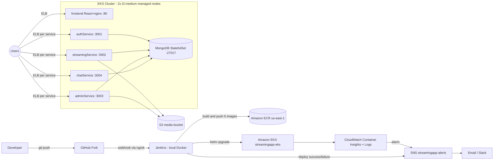

# StreamingApp — System Architecture

## Overview

StreamingApp is a MERN-stack video streaming platform built as five containerized microservices plus MongoDB, deployed on Amazon EKS with a fully automated CI/CD pipeline (Jenkins) and centralized monitoring (CloudWatch).

## Architecture Diagram



## Components

| Component | Tech | Port | Kubernetes object | Exposure |
|---|---|---|---|---|
| frontend | React build served by nginx | 80 | Deployment + HPA | LoadBalancer (ELB) |
| authService | Node.js/Express — signup, login, JWT | 3001 | Deployment + HPA | LoadBalancer |
| streamingService | Node.js/Express — catalogue, S3 playback | 3002 | Deployment + HPA | LoadBalancer |
| adminService | Node.js/Express — asset management, uploads | 3003 | Deployment + HPA | LoadBalancer |
| chatService | Node.js/Express + Socket.IO — live chat | 3004 | Deployment + HPA | LoadBalancer |
| MongoDB | mongo:6 | 27017 | StatefulSet + 5Gi EBS PVC | ClusterIP (internal only) |

## Key design decisions

**Docker build contexts.** authService builds from its own folder; streaming/admin/chat build from `backend/` with `-f backend/<service>/Dockerfile` (they share the backend context). The frontend is a multi-stage build (node → nginx).

**Frontend URLs are build-time.** React bakes `REACT_APP_*` API URLs into the bundle at `npm run build`. The pipeline therefore uses a two-run flow: Run 1 deploys backends and obtains their ELB DNS names; Run 2 rebuilds the frontend with those real URLs.

**Configuration and secrets.** Non-sensitive config (Mongo URI, S3 bucket, region, CORS origins) is injected as env vars from Helm values. Sensitive values (JWT secret, AWS keys for S3) live in a Kubernetes Secret referenced via `secretKeyRef`.

**Scaling.** Every service has a HorizontalPodAutoscaler (CPU target 70%, min 1, max 4) backed by metrics-server. The managed nodegroup can scale 2 → 3 nodes.

**Self-healing.** Deployments recreate crashed/deleted pods automatically; MongoDB data survives pod restarts via its EBS-backed PersistentVolume.

## CI/CD flow

1. Developer pushes to `main` on the GitHub fork.
2. GitHub webhook (exposed through an ngrok tunnel) triggers the Jenkins pipeline.
3. Jenkins: checkout → ECR login → build 4 backend images → build frontend image (with production URLs as build args) → push all images tagged with the 12-char git commit SHA → `helm upgrade --install` on EKS.
4. Post-build: SNS publishes deployment success/failure → email/Slack.

Image tags are git SHAs, so every running container is traceable to an exact commit.

## Monitoring and logging

- **CloudWatch Container Insights** (CloudWatch agent DaemonSet): per-pod/per-node CPU, memory, network metrics.
- **Fluent Bit DaemonSet**: ships all container stdout/stderr to the log group `/aws/containerinsights/streamingapp-eks/application` — centralized application logging.
- **CloudWatch alarm** `streamingapp-high-cpu`: fires when average pod CPU in the `streamingapp` namespace exceeds 80% for 10 minutes → SNS → email/Slack.

## Repository layout

```
StreamingApp/
├── Jenkinsfile                 # CI/CD pipeline
├── docker-compose.yml          # local development
├── frontend/                   # React app + Dockerfile
├── backend/
│   ├── authService/            # Dockerfile inside
│   ├── streamingService/       # Dockerfile inside (context = backend/)
│   ├── adminService/
│   └── chatService/
├── helm/streamingapp/          # Helm chart (deployments, services, mongo, hpa, secrets)
├── scripts/                    # create-ecr-repos, build-and-push-ecr, deploy-eks,
│                               # get-service-urls, cleanup
└── docs/                       # this documentation
```
